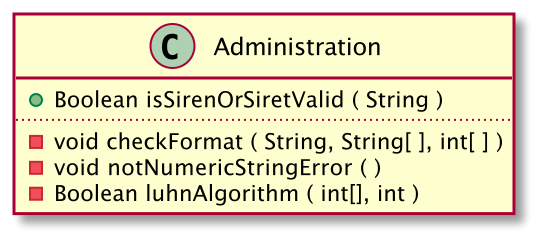

# READ ME UNDER CONSTRUCTION

This repository will give us some tools for different type of handlers.  
In truth, it serves me to practice on the java language and Spring-boot 
afterwards.

## SIREN / SIRET validation

Inside the package handlers.entreprise, we have class Administration. 
Sometimes we need to check if the SIREN/SIRET of an entreprise is a correct 
one. 

### UML 



- Administration.isSirenOrSiretValid( )

```java
public class README {
    public static void main(String[] args) {
            Administration handler = new Administration();
            boolean result = handler.isSirenOrSiretValid("732829320");
            
            System.out.println(result);
            // TRUE
        }
}
```